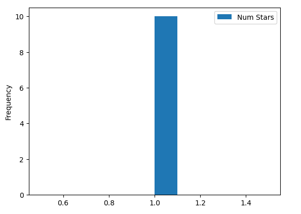
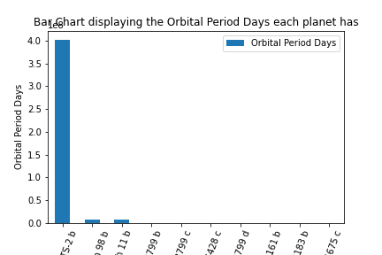
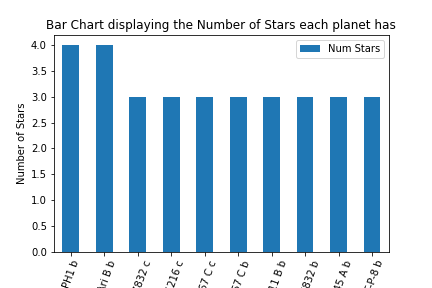
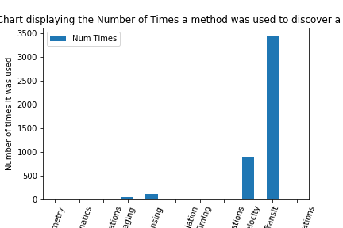

# COSC 301 Project Group 35

## Introduction
Our project is an analysis of the exoplanets that exist outside of our solar system. This dataset comprises of some of its properties. We are interested in this data because we are fascinated about the planets that do not exist in our solar system and also possibly determine if life is possible on these planets

# Exploratory Data Analysis

## Dakota Bonvie - How can we accurately make a prediction on the percent chance of habitability of an exoplanet?

Throughout the sorting and processing of our data for this question I found that the habitability largely depends on it's characteristics as well as it's properties. 

It has been determined that Photometry / Transit is the best and only method with the most promising results for finding Earth-size planets within the habitable zone. Photometry / transit method  is a method in which the brightness of a star is measured. With this we can determine many properties of the exoplanet. 

In Detail Explanation of Photometry / Transit Photometry Below -

When using Photometry, astronomers can also determine the temperature and color fo the star they are observing. With transit photometry the drops in observable light are mesured which can aid in the calculations of the planet's size. 

Below Is a visualization of the usage of Discovery Methods.
---

As stated before, planet's habitability can be determined through it's characteristics, enviromental stability, atmosphere, gravitation interactions within it's orbit(s), and other properties. 

We used the known requirements to make an estimate on if it is realistic for exoplanets with multiple stars to be habitable. 

A planet that orbits two or more stars is classified as a circumbinary planet. 
Through research as well as data colected we found that it is generally less likely for planets in multi-star systems to harbor life / be habitable. 

Visualization of multi-star systems
---

Predicted Habitable planets vs Non-Habitable Planets

There are many requirements for a planet to be habitable and scientists have already predicted a few which may be candidates for a future colony. The temperature is also a large factor which must be taken into consideration. 

Main factors for habitability are Mass, orbit properties, and Temperature.
By general knowledge and reserach gathered, it is generally stated that in order for a plent to be potentially habitable, the exoplanet must have a mass related / near earthlike mass (5.972 x 10^24 kg)

By checking our data, we can create a visualization of planets with closest earth like masses / potential candidates. 

## Question 2 + Results
## Boluwatife Yomi-Adeyemi - How do the properties of exoplanets influence a human's chance of survival?

Trying to figure out the answer to this question, I first produced a normal table that gives me the name of the exoplanets and some of its properties. I then made a bar chart which inluded the top 10 exoplanets with the highest orbital period days. Orbital period days mean "how long it takes a planet to revolve round its star." The bar chart will be presented below:

After visualizing my data, I needed to determine which planets have the highest number of stars. I made a bar chart that displays the top 10 exoplanets that possess the highest number of stars. This is important because we need to be sure if planets, that have more than one star, are habitable. 

Finally, I tried to look for the most popular method used to find exoplanets. The bar chart below shows that the transit method is the most used method to discover exoplanets. This is because the transit method is the easiest method to use and also gives the most accurate result. The transit method uses the light curve to determine the size of a planet.

Overall, although these charts were able to show some of the properties that influence a human's chance of survival, it still shows that there are a few more things that we need to determine if humans can survive on a planet or not. Another important point that could not be addressed from the dataset is the possibility of liquid water on the planet. Due to not having a method of determining if water could be on the planet, it is almost impossible for us to determine if life could exist on any of those planets.

The link to my notebook is here: [Link to my Notebook](http://localhost:8888/lab/tree/notebooks/analysis2.ipynb)

## Question 3 + Results

## Conclusion
